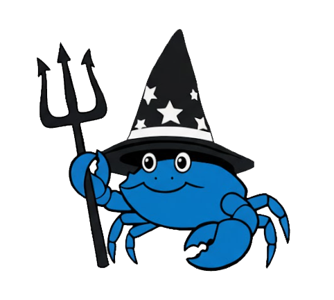
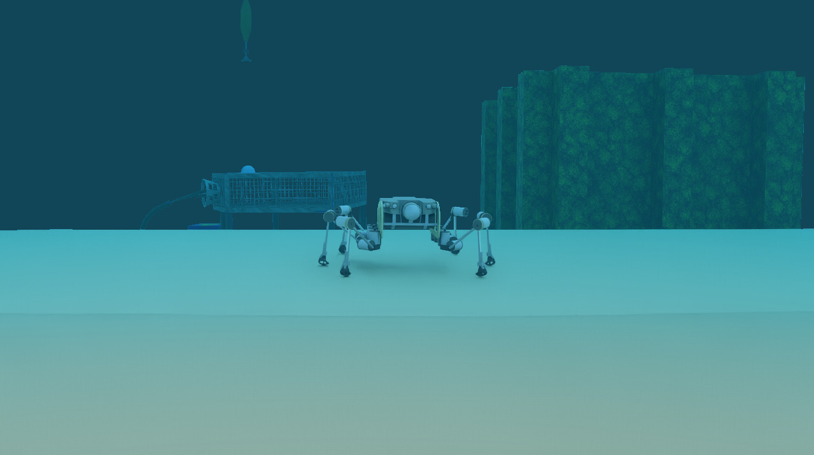

<div align="center">



# SILVER2 - Isaac Sim Environment

**High-fidelity simulation of the SILVER2 bio-inspired robot using NVIDIA Isaac Sim.**

[](LICENSE)
[](https://developer.nvidia.com/isaac-sim)
[](https://www.python.org/)

</div>

---

## 🌊 Overview

This repository contains the simulation assets, physics plugins, and environments for the **SILVER2** seabed exploration robot within NVIDIA Isaac Sim. 

The environment is a digital twin of the **OBSEA Underwater Observatory** in Vilanova i la Geltrú, Catalonia, providing a realistic testing ground for seabed locomotion.

Unlike standard rigid-body simulations, this project implements a **custom, fully vectorized hydrodynamics engine** powered by **Numba**. This allows for real-time, accurate simulation of fluid-structure interactions—including complex drag, added mass, and buoyancy effects—enabling the robot to walk and maneuver realistically on the virtual seabed.

The visual sensing in this project utilizes the optical underwater camera model developed by [OceanSim](https://github.com/umfieldrobotics/OceanSim).


*SILVER2 exploring the OBSEA observatory digital twin.*

---

## 🚀 Key Features

### 1. Custom Numba Hydrodynamics Engine
We bypass the standard simplified linear damping to achieve realistic underwater behavior. The physics engine calculates:
* **Variable Buoyancy:** Accurate volume displacement allowing for static neutral buoyancy.
* **Hybrid Drag Model:** Combines quadratic drag ($v^2$) for high-speed realism with linear damping for low-speed stability.
* **Added Mass & Inertia:** Simulates the "heaviness" of water displaced during acceleration (Coriolis/Centripetal effects approximation).
* **Lift Forces:** Dynamic lift calculation based on the angle of attack.
* **Performance:** Written in **Numba JIT** for C++ level performance within Python.

### 2. Verified Locomotion Controller
This repo utilizes the same robust locomotion controller used in our field trials and other simulators:
* [SILVER2 Stonefish](https://github.com/Joagai23/silver2_stonefish)
* [SILVER2 Gazebo](https://github.com/Joagai23/silver2_gz)

---

## 🎥 Gallery

### Hydrodynamics Validation
Testing the custom physics package. The buoy oscillates naturally in the water, demonstrating the interplay between buoyancy, gravity, and our custom drag model.

<div align="center">
  
</div>

### Walking Locomotion
The robot utilizing the 6-legged gait controller to navigate the seabed. The physics interaction between the legs and the sand material is tuned to prevent penetration while maintaining traction.

<div align="center">
  
</div>

### Environment: OBSEA Vilanova
A panoramic view of the robot walking through the digital twin of the OBSEA observatory.

<div align="center">
  
</div>

---

## 🛠️ Installation & Usage

1. **Prerequisites**
   * NVIDIA Isaac Sim (5.0 or newer recommended)
   * RTX GPU with updated drivers

2. **Clone the Repository**
    ```bash
    git clone https://github.com/Joagai23/silver2_isaacsim.git
    ```
### 3. Running the Simulation
1.  Launch **NVIDIA Isaac Sim**.
2.  Open the Script Editor or the Content Browser.
3.  Navigate to and load the main stage: 
    `src/scenes/silver2_isaac_sim.usd`
4.  Press the **PLAY** button. 
    * Note: The `HydrodynamicsBehavior` script will initialize, and the robot will settle on the seabed.
5.  Locomotion controls can be accessed via the standard ROS bridge or the provided python interface.
    * Keyboard Teleoperation
        ```bash
        # Source the ROS 2 environment
        source /opt/ros/jazzy/setup.bash

        # Run the keyboard teleop node
        ros2 run teleop_twist_keyboard teleop_twist_keyboard
        ```
    * Static Gait
        ```bash
        # Source the ROS 2 environment
        source /opt/ros/jazzy/setup.bash
        
        # Generate a drive for the robot
        ros2 topic pub --once /cmd_vel geometry_msgs/msg/Twist "{linear: {x: 1.0, y: 0.0, z: 0.0}, angular: {x: 0.0, y: 0.0, z: 0.0}}"
        ```
---

## ⚙️ Configuration

The robot's physics are fully configurable via the USD Property panel or directly in the `HydrodynamicsBehavior` script. Key parameters include:

| Parameter | Default | Description |
| :--- | :--- | :--- |
| `waterDensity` | `1025.0` | Density of the fluid in $kg/m^3$. |
| `gravity` | `9.81` | Gravitational acceleration in $m/s^2$. |
| `xDimension` | `1.0` | Object dimension along its local X-axis (m). |
| `yDimension` | `1.0` | Object dimension along its local Y-axis (m). |
| `zDimension` | `1.0` | Object dimension along its local Z-axis (m). |
| `linearDragCoefficient` | `1.2` | Quadratic linear drag coefficient ($C_d$). |
| `angularDragCoefficient` | `0.8` | Quadratic angular drag coefficient. |
| `linearDamping` | `300.0` | Linear damping multiplier for low-speed stability. |
| `angularDamping` | `150.0` | Linear angular damping for low-speed stability. |
| `linearAddedMassCoefficient` | `0.05` | Added mass coefficient for surge, sway, and heave acceleration. |
| `angularAddedMassCoefficient` | `0.02` | Added mass coefficient for roll, pitch, and yaw acceleration. |
| `liftCoefficient` | `1.0` | A multiplier for the overall strength of the lift force. |

---

## 🦀 The SILVER2 Project

SILVER2 is a bio-inspired robot designed for low-impact seabed interaction. This Isaac Sim environment is part of a larger ecosystem of simulation tools designed to validate control strategies before deployment.

**Check out our other simulators:**
* **Stonefish Repo:** [Joagai23/silver2_stonefish](https://github.com/Joagai23/silver2_stonefish)
* **Gazebo Repo:** [Joagai23/silver2_gz](https://github.com/Joagai23/silver2_gz)

### Acknowledgements
The project is carried out within the framework of the activities of the Spanish Government through the “Severo Ochoa Centre of Excellence” granted to ICM-CSIC (CEX2024-001494-S) and the Research Unit Tecnoterra (ICM-CSIC/UPC).

This project is supported by the Horizon Europe [**MERLIN Project**](https://merlin-project.org/) [grant number GAP-01189796] and [**Blue Project**](https://www.blue-project.eu/) [grant number 101061354].

<div align="center">


<sub><i>"Magic happens at the bottom of the sea."</i></sub> </div>
